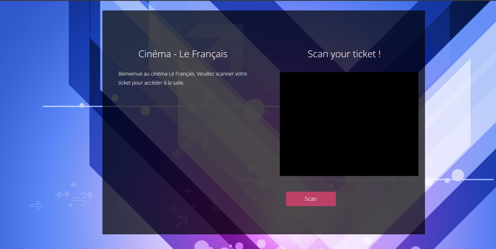
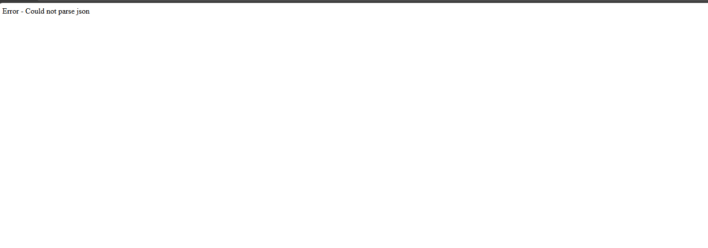
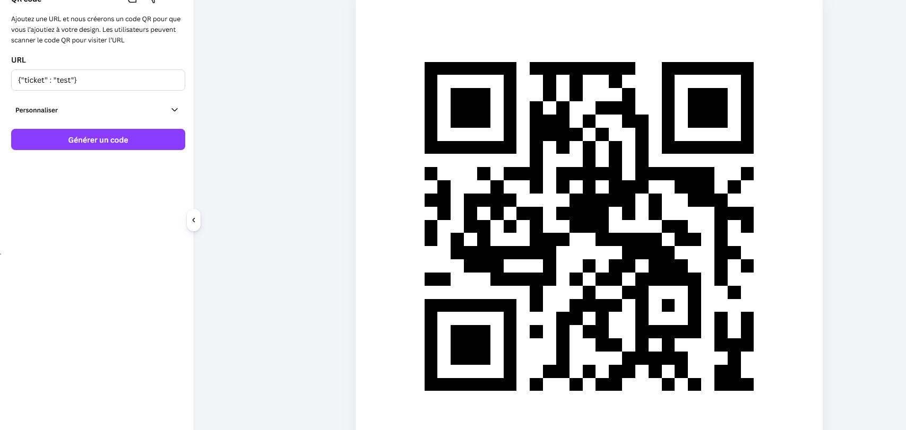
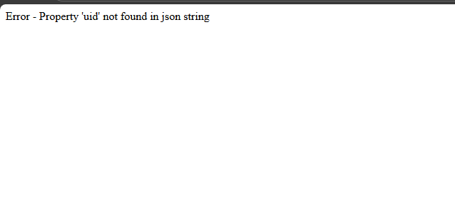
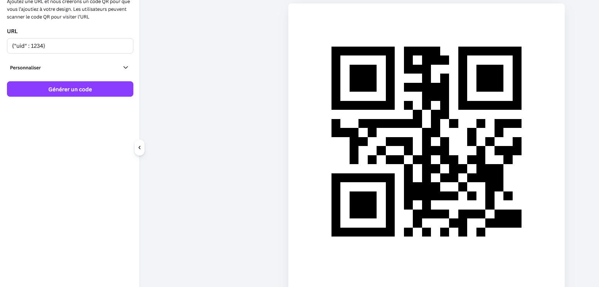
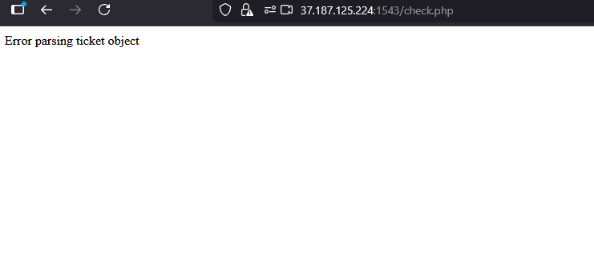
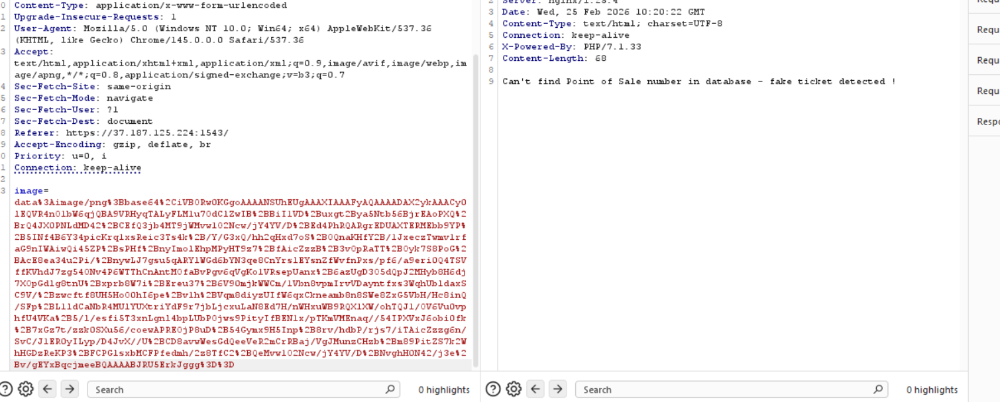

# TP

- Arrivé sur le site

- lorsque l'on appuie sur le bouton scan

- Génération d'un qrcode pour tester

- Réponse du site

- nouveau qrcode avec uid en clé

- réponse du site

- test avec la clé ticket en plus

- réponse du site

- script pour la création des qr code