# TP

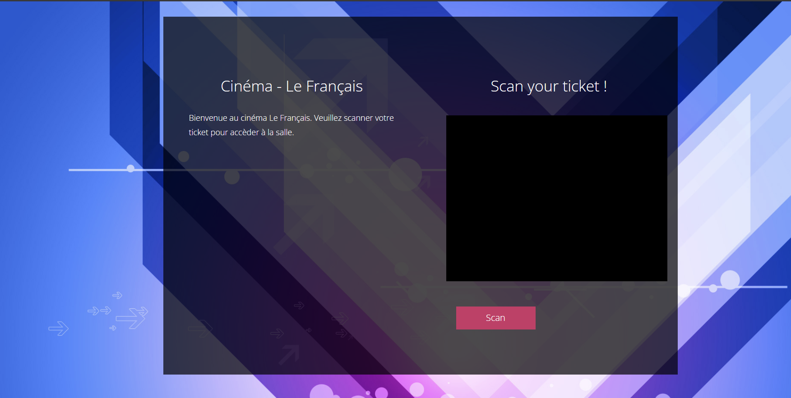
- Arrivé sur le site
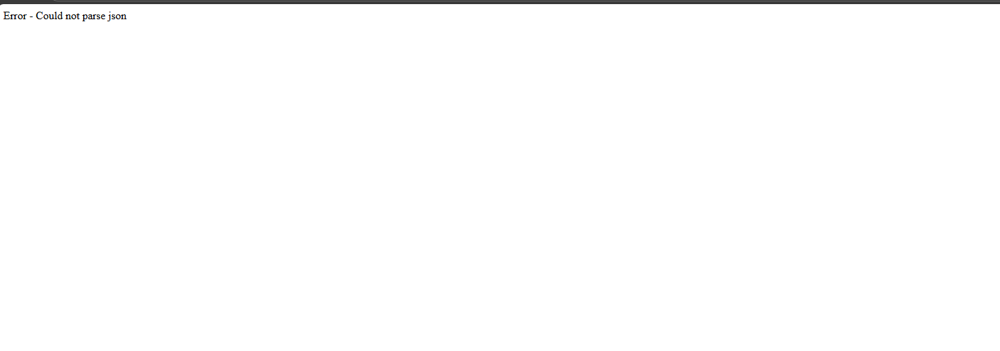
- lorsque l'on appuie sur le bouton scan

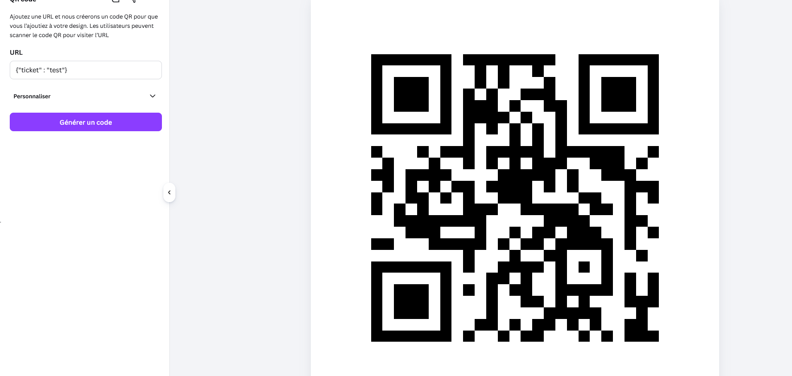
- Génération d'un qrcode pour tester

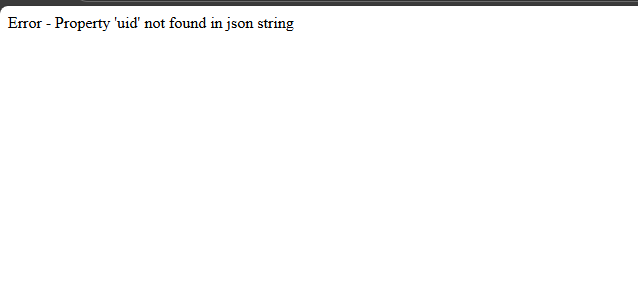
- Réponse du site

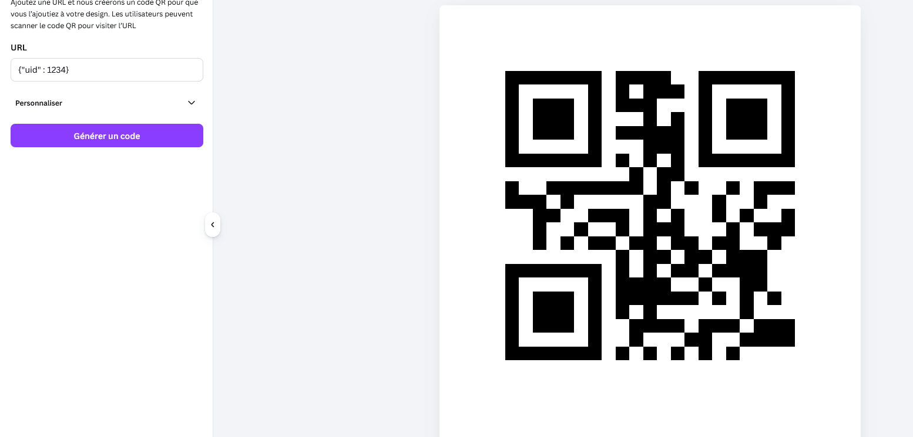
- nouveau qrcode avec uid en clé

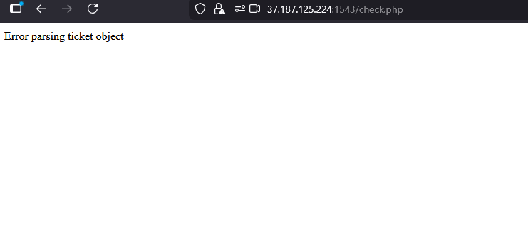
- réponse du site

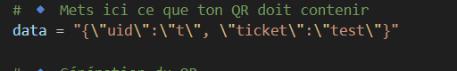
- test avec la clé ticket en plus

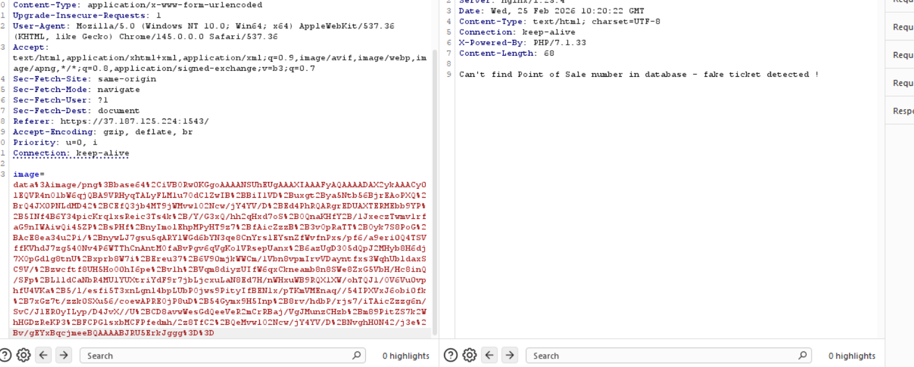
- réponse du site

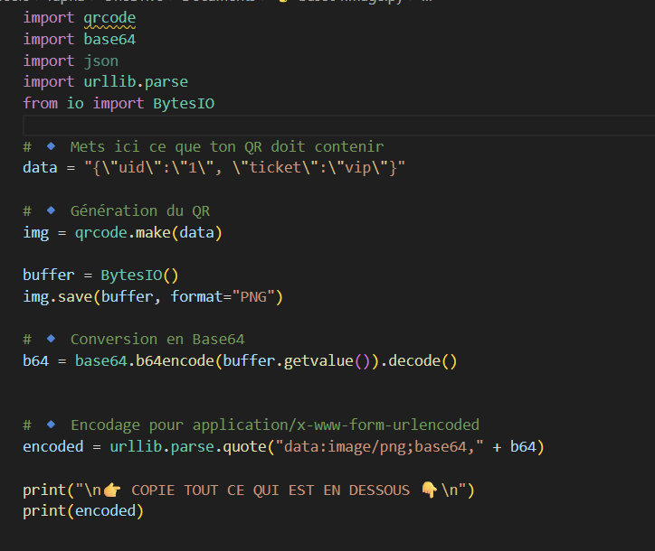
- script pour la création des qr code

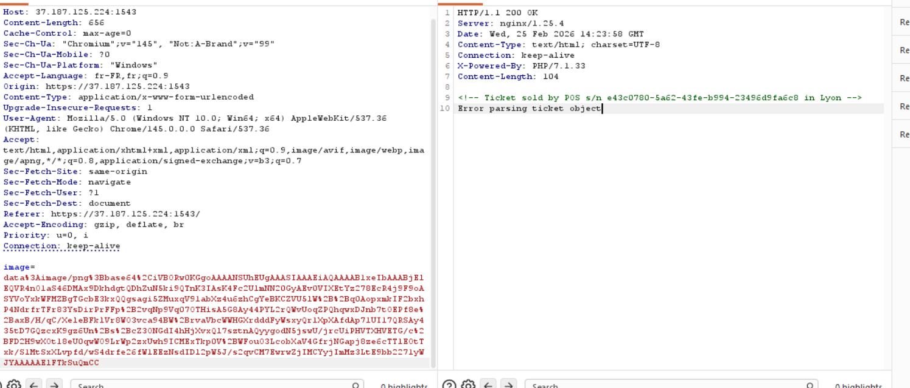
- Avec uid = 3 on trouve lyon, avec uid = 1 on trouve bordeaux et uid = 2 on trouve lille et uid = 4 on trouve rien

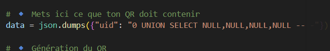

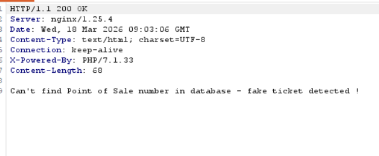
- Lorsqu'on cherche avec 3 colonne ou 5 on trouve ça

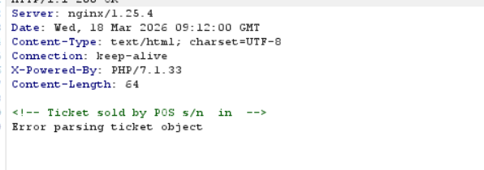
- avec les 4 colonnes on trouve ça ce qui veut dire qu'on a 4 colonnes on peut maintenant chercher laquelle on peut eploité

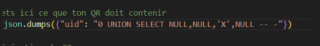
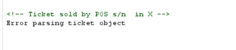
- On trouve que la 3 eme colonne est exploitable

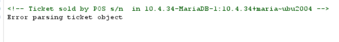
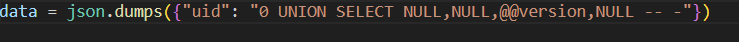
- On trouve la version et qu c'est du mariaDB

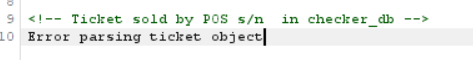
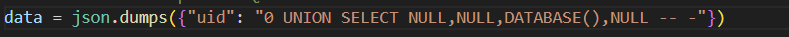
- On voit peut voir la base de la base de donné et commencer à chercher le nom des colonnes

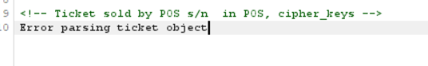
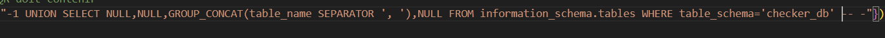
- J'ai trouvé 2 colonnes et leurs nom dans la db

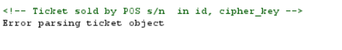
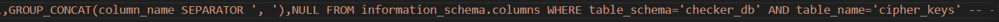
- On trouve 2 colonne dans cypher_keys

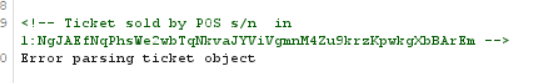
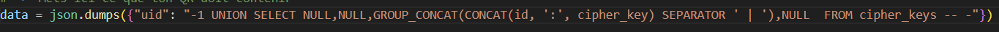
- On a trouvé un id dedans